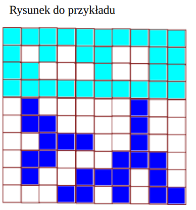

# Problem 1 - Mapa
### Algorytmy i struktury danych, pracownia specjalistyczna, studia stacjonarne, zestaw zadań nr 2
### Prowadzący: Krzysztof Ostrowski

Na pewnej nowo odkrytej planecie wykonano zdjęcia satelitarne i sporządzono cyfrową mapę terenu.
Wyróżniono na niej obszary lądowe oraz wodne (rzeki jak i zbiorniki wodne).
Na podstawie zebranych danych postanowiono zbadać charakterystykę terenu, ze szczególnym uwzględnieniem rzek i wysp.

Dane są dużych rozmiarów i niezbędne do tego jest specjalistyczne oprogramowanie.

Mapa obszaru to prostokątny obszar z trzema rodzajami pikseli:
- ‘x’ oznacza ląd,
- ‘o’ oznacza wodę stojącą,
- ‘u’ oznacza rzekę.

Spójnym obszarem lądowym nazywamy piksele połączone ze sobą wjednym z 8 kierunków mapy (góra, dół, prawo, lewo i skosy). Z kolei spójny obszar wodny to piksele połączone ze sobą przynajmniej w jednym z 4 kierunków (góra, dół, lewo, prawo).

Wyspą nazywamy spójny obszar lądowy z każdej strony otoczony wodą stojącą (czyli nie stykający się z krawędzią mapy), na mapie nie ma rzecznych wysp.

Z kolei rzeki na mapie zawsze mają szerokość 1 piksela (z wyjątkiem ujść jednej do drugiej) i zawsze kończą swój bieg w zbiorniku wody stojącej lub w innej rzece.
Ponadto, rzeki nie rozgałęziają się na równoległe koryta (jak Narew), nie tworzą delt i nie ma ich na wyspach.

**Napisz program, który dokona analizy danych i znajdzie największą wyspę i najdłuższą rzekę (mierzoną od ujścia do najdalszego źródła).**

## Wejście:
W pierwszym wierszu wejścia podane są liczby n, m (3<=n, m<=1000) oznaczające liczbę kolumn i liczbę wierszy mapy. W kolejnym m wierszach podanych jest po n pikseli mapy.
## Wyjście:
W jedynym wierszu wyjścia mają się pojawić 2 liczby oznaczające odpowiednio powierzchnię największej wyspy i długość najdłuższej rzeki.

### Przykład:
**Wejście**:
```
10 10
oooooooooo
oxoxooxxoo
ooxxxoxxoo
oooooooooo
xuxxxxxuxx
xuuxxxxuxx
xxuuuxxuxx
xuuxxxuuux
xuxxuuuxux
xxxuuxuxuu
```

**Wyjście**:
```
5 10
```

